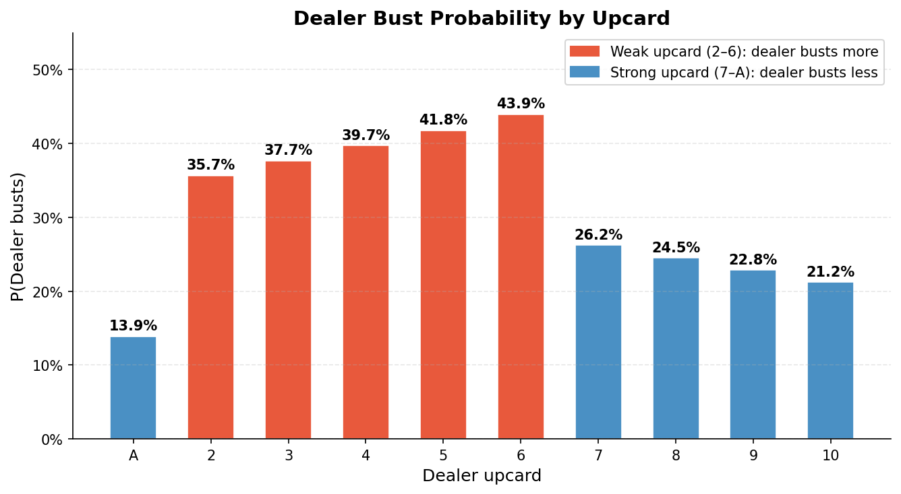
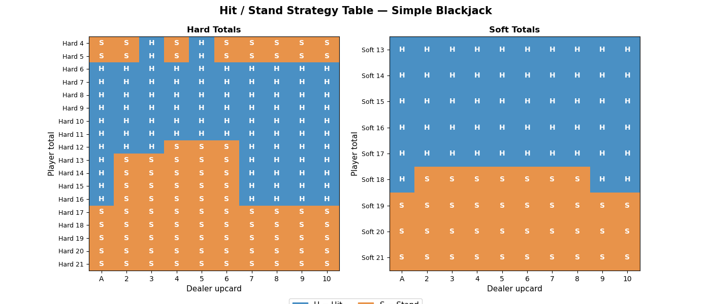
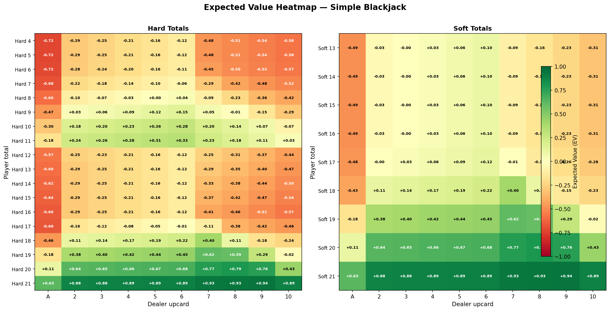
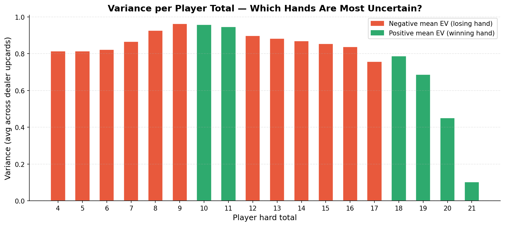
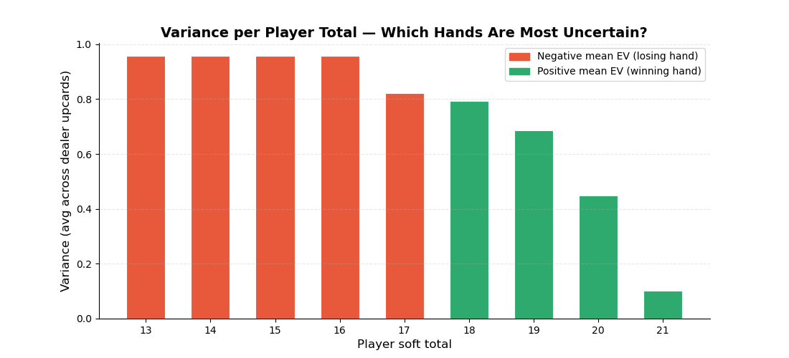

# Simple Blackjack — Probability & Strategy


---

## Table of Contents

1. [What is Simple Blackjack?](#1-what-is-simple-blackjack)
2. [The Core Question](#2-the-core-question)
3. [How We Model the Cards](#3-how-we-model-the-cards)
4. [How We Model the Dealer](#4-how-we-model-the-dealer)
5. [Expected Value — Hit or Stand?](#5-expected-value--hit-or-stand)
6. [Strategy Table](#6-strategy-table)
7. [Visualizations](#7-visualizations)
8. [Expected Value & Variance](#9-expected-value--variance)
9. [Interactive Game](#10-interactive-game)

---

## 1. What is Simple Blackjack?

This is a stripped-down version of Blackjack with only two actions:

| Action | Meaning |
|--------|---------|
| **Hit** | Draw one more card |
| **Stand** | Keep your current total, let dealer play |

No doubling, no splitting, no surrender, no blackjack bonus.

**Card values:**
- Number cards (2–9): face value
- 10, J, Q, K: all equal 10
- Ace: 1 or 11 — whichever does not bust you

**Who wins:**
- Player total closer to 21 than dealer → **+1**
- Dealer busts (goes over 21) → **+1**
- Equal totals → **0**
- Dealer closer to 21 → **−1**
- Player busts → **−1** immediately

---

## 2. The Core Question

For every possible situation, we want to answer:

> **"Should I Hit or Stand?"**

A situation is defined by two things you can see:
- Your own hand total (4 to 21)
- The dealer's one visible card (upcard)

The dealer's second card is hidden — you never know it. So all decisions are based only on **your total** and the **dealer's upcard**.

---

## 3. How We Model the Cards

We assume an **infinite deck** — every card draw is independent with fixed probabilities:

```
P(draw a 2) = P(draw a 3) = ... = P(draw a 9) = 1/13
P(draw a 10) = 4/13   ← because 10, J, Q, K all count as 10
P(draw an Ace) = 1/13
```

**Why infinite deck?**  
In a real 52-card deck, drawing one card changes the remaining probabilities. With an infinite deck, every draw is always the same — simpler and still very accurate.

**Soft vs Hard hands:**

| Type | Meaning | Example |
|------|---------|---------|
| **Soft** | Has an Ace counted as 11 | Ace + 6 = Soft 17 |
| **Hard** | No Ace, or Ace must be 1 | 10 + 7 = Hard 17 |

Why does this matter? Soft 17 and Hard 17 look the same as a number, but they behave differently — you can safely hit a soft hand because if you bust, the Ace flips from 11 to 1 to save you.

---

## 4. How We Model the Dealer

The dealer follows a **fixed rule** — no choice involved:

```
Draw cards until total >= 17
Special case: Soft 17 (Ace=11, total=17) → must draw again
Hard 17 or above → stop
```

### Dealer Final Distribution

Given the dealer's upcard, we calculate the probability of every possible outcome using a loop that simulates all drawing paths:

```
Dealer shows 6 → simulate all possible draw sequences:

  6 + 10 = 16 → draw again
  6 + 10 + 5  = 21 → STOP ✓
  6 + 10 + 7  = 23 → BUST ✗
  6 + Ace     = Soft 17 → draw again (soft 17 rule!)
  6 + Ace + 4 = 21 → STOP ✓
  ... (all paths weighted by probability)
```

**Final result for dealer upcard 6:**

| Dealer ends at | Probability |
|----------------|------------|
| 17 | 16.7% |
| 18 | 10.6% |
| 19 | 10.6% |
| 20 | 10.6% |
| 21 | 9.7% |
| **Bust** | **42.3%** ← dealer 6 is very weak! |

---

## 5. Expected Value — Hit or Stand?

For every situation we compute two numbers and pick the higher one.

### EV(Stand)

If you stand at total T against dealer upcard U:

```
EV(Stand) = P(dealer busts) × (+1)
           + P(dealer total < T) × (+1)
           + P(dealer total = T) × (0)
           + P(dealer total > T) × (−1)
          = P(Win) − P(Lose)
```

### EV(Hit)

If you hit from total T:

```
EV(Hit) = sum over all possible cards c:
            P(draw c) × outcome(new total, upcard)

where outcome = −1 if bust, else EV from new total (optimal play)
```

### Decision

```
if EV(Hit) > EV(Stand)  →  Hit
else                    →  Stand
```

### Example: Hard 16 vs Dealer 6

```
EV(Stand) = 0.42 − 0.58 = −0.12   (dealer busts 42% of the time)
EV(Hit)   = ≈ −0.49               (too many cards bust you from 16)

−0.12 > −0.49  →  STAND ✓
```

Both are negative — Hard 16 is a bad hand no matter what. But standing loses you less on average because the dealer has a good chance of busting on their own.

---

## 6. Strategy Table

By repeating the EV calculation for every combination, we get the full strategy table:

- **Hard totals 4–21** × **Dealer upcard A, 2–10** = 180 cells
- **Soft totals 13–21** × **Dealer upcard A, 2–10** = 90 cells
- **Total: 270 cells**

**Reading the table:** H = Hit, S = Stand

```
              Dealer upcard
              A   2   3   4   5   6   7   8   9  10
Hard 12       H   H   H   S   S   S   H   H   H   H
Hard 13       H   S   S   S   S   S   H   H   H   H
Hard 14       H   S   S   S   S   S   H   H   H   H
Hard 15       H   S   S   S   S   S   H   H   H   H
Hard 16       H   S   S   S   S   S   H   H   H   H
Hard 17       S   S   S   S   S   S   S   S   S   S
```

**Key pattern:** Stand against dealer 2–6 (weak upcards), Hit against dealer 7–Ace (strong upcards). This is because weak dealers bust often — so you just need to survive.

---

## 7. Visualizations

### Plot 1 — Dealer Bust Probability

**What it shows:** How often the dealer busts for each upcard.

**How to read it:** Taller bar = dealer more likely to bust = better for you. Dealer 5 and 6 are the weakest upcards with ~40% bust rate. Dealer Ace is the strongest with only ~17% bust rate.

**Why it matters:** This directly explains the strategy table — when the dealer is weak (5, 6), you stand more and let them bust. When the dealer is strong (7–Ace), you hit more because they are unlikely to bust on their own.



---

### Plot 2 — Hit/Stand Decision Boundary

**What it shows:** The full strategy table as a color grid. Blue = Hit, Orange = Stand.

**How to read it:** Find your hand total on the left axis, find the dealer upcard on the top axis, the color at that intersection tells you what to do.

**Key pattern to spot:** There is a clear orange block in the middle (Hard 12–16 vs dealer 2–6) — this is the zone where you stand even with a bad hand because the dealer is likely to bust. Everything below 12 is blue because you can never bust by hitting low totals.



---

### Plot 3 — EV Heatmap

**What it shows:** The expected payoff for every cell. Red = you will likely lose, Green = you will likely win.

**How to read it:** The greener the cell, the better your position. You can see immediately that the top rows (high player totals like 20, 21) are green almost everywhere. The bottom rows (low totals like 4–8) are deep red because your hand is weak AND you might bust trying to improve it.

**Interesting observation:** Even the best strategy cannot overcome a bad hand — Hard 16 is red everywhere, meaning you are expected to lose no matter what the dealer shows. The strategy just minimizes how much you lose.



---

### Plot 4 — Variance per Hand

**What it shows:** How uncertain the outcome is for each player total.

**How to read it:** High bar = outcome is unpredictable (could win or lose). Low bar = outcome is more certain.

**Why it matters:** Mid-range totals like 15–16 have the highest variance — sometimes the dealer busts and you win, sometimes you bust and lose. Very high totals like 20–21 have lower variance because the outcome is more predictable (you almost always win).




---

## 8. Expected Value & Variance

**Overall EV** (averaged across all starting hands and dealer upcards):

```
EV ≈ −0.006

Meaning: following optimal strategy, you lose about 0.6% per hand on average.
This is the house edge — the casino's mathematical advantage.
```

**Variance formula:**

```
Var = E[X²] − (E[X])²

Since X ∈ {−1, 0, +1}:
  E[X²] = P(Win) × 1 + P(Draw) × 0 + P(Lose) × 1
         = P(Win) + P(Lose)

So: Var = P(Win) + P(Lose) − EV²
```

High variance means the game is risky — individual outcomes swing between win and lose even when the average EV is predictable.

---

## 9. Interactive Game

The interactive game lets you play hands manually while showing the optimal strategy hint at each step.

**How it works:**
1. Cards are dealt randomly
2. You choose Hit or Stand
3. The game shows: optimal action, EV(Hit), EV(Stand), P(Win/Draw/Lose)
4. Dealer plays automatically following the fixed rule
5. Running EV is tracked across all hands

The hints come directly from the strategy table built by the analytical calculation ja

